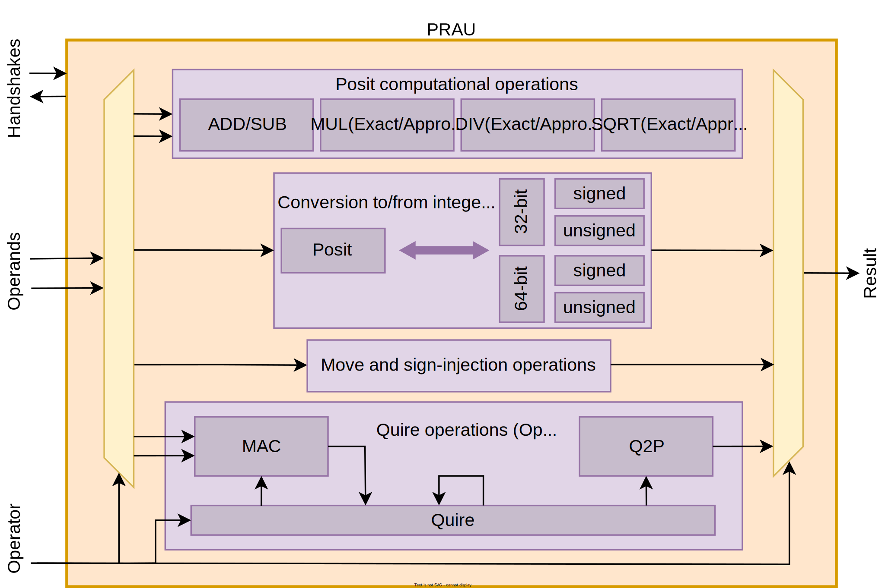

# PRAU: Posit and quiRe Arithmetic Unit

PRAU started its journey as the Posit Arithmetic Unit (PAU) available in the [PERCIVAL](https://github.com/artecs-group/PERCIVAL) posit RISC-V core. Then, it has been used for the [Coprosit](https://github.com/esl-epfl/Coprosit) coprocessor and [PHEE](https://github.com/esl-epfl/PHEE).

If you use the PRAU in your academic work, you can cite our [PERCIVAL paper](https://ieeexplore.ieee.org/document/9817027), its extension in [Big-PERCIVAL](https://ieeexplore.ieee.org/document/10473215), and our latest [preprint](https://arxiv.org/abs/2501.18253).

BibTeX

  
~~~BibTeX
@article{mallasen2022PERCIVAL,
  title = {PERCIVAL: Open-Source Posit RISC-V Core With Quire Capability},
  author = {Mallas{\'e}n, David and Murillo, Raul and Barrio, Alberto A. Del and Botella, Guillermo and Pi{\~n}uel, Luis and {Prieto-Matias}, Manuel},
  year = {2022},
  journal = {IEEE Transactions on Emerging Topics in Computing},
  volume = {10},
  number = {3},
  pages = {1241--1252},
  issn = {2168-6750, 2376-4562},
  doi = {10.1109/TETC.2022.3187199}
}
~~~

~~~BibTeX
@article{mallasen2024BigPERCIVAL,
  title = {Big-PERCIVAL: Exploring the Native Use of 64-Bit Posit Arithmetic in Scientific Computing},
  author = {Mallas{\'e}n, David and Del Barrio, Alberto A. and {Prieto-Matias}, Manuel},
  year = {2024},
  journal = {IEEE Transactions on Computers},
  volume = {73},
  number = {6},
  pages = {1472--1485},
  issn = {0018-9340, 1557-9956, 2326-3814},
  doi = {10.1109/TC.2024.3377890}
}

~~~

~~~BibTeX
@misc{mallasen2025Increasing,
      title={Increasing the Energy-Efficiency of Wearables Using Low-Precision Posit Arithmetic with PHEE}, 
      author={David Mallasén and Pasquale Davide Schiavone and Alberto A. Del Barrio and Manuel Prieto-Matias and David Atienza},
      year={2025},
      eprint={2501.18253},
      archivePrefix={arXiv},
      primaryClass={cs.AR},
      url={https://arxiv.org/abs/2501.18253}, 
}
~~~

## Posit configuration

To configure the posit size, specify the appropiate flag when running FuseSoC, i.e. `--flag=use_posit32`.
You can also set flags to include log-approximate multiplication, division, and square root units, or to include quire operations.

The available flags are the following:
- Posit size: `use_posit8`, `use_posit16`, `use_posit32`, `use_posit64`
- Posit log-approximate units: `use_pos_log_mult`, `use_pos_log_div`, `use_pos_log_sqrt`
- Quire operations: `use_quire`

## Example

~~~bash
fusesoc --cores-root . run --no-export --target=sim --flag=use_posit32 --flag=use_quire --setup --build esl-epfl:ip:prau:0.0.1
cd build/esl-epfl_ip_prau_0.0.1/sim-modelsim
make run-gui
~~~
